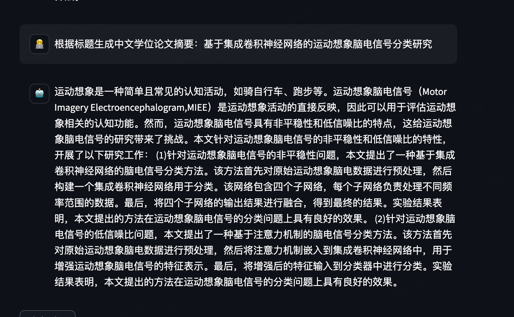
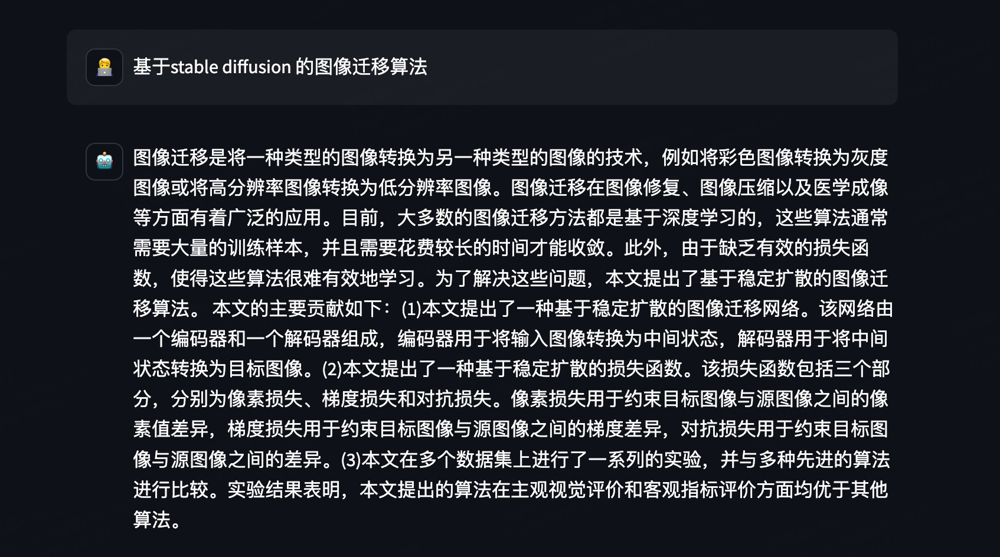

## 目录
- [项目简介](#项目简介)
- [整体架构](#整体架构)
- [模型评估](#模型评估)
- [模型预训练](#模型预训练)
- [模型微调](#模型微调)

## 项目简介
Novel-GPT 是一个开源的网文大语言模型，本项目的目的是基于现有的开源大模型 Baichuan,qwen 来进行领域预训练，后续如果有更好的基座会进行切换。
经过多次实验，当前效果来看，qwen是目前最好的开源基座，后面整体会全部切换到qwen。

本项目依托于网文数据，主要进行以下几个方面的工作：
- 基于论文摘要数据的微调，原因在于小说任务难以评测，用论文摘要任务来验证代码以及模型能力
- 基于网文数据进行领域 Pretain
- 支持主流的开源大模型，如 [qwen](), [baichuan1](https://github.com/baichuan-inc/Baichuan-7B), [baichuan2](https://github.com/baichuan-inc/Baichuan2),
- 模型架构优化：采用向量融入的方式，针对小说场景下的生成问题进行模型结构优化，致力于解决小说超长文本问题。 -- 核心改进，待开源
- 开源小说预训练数据集，论文摘要数据集

## 整体架构
我将我在做小说训练过程中用到的代码全都开放出来了，主要包括以下几个部分：
- Baichuan-Pretrain: 预训练的详细代码
- Baichuan-Finetune： 全参数微调的详细代码
- Baichuan-Finetune-Lora：基于 lora 进行微调的详细代码

## 模型评估

```
pip install -r requirements.txt
```

基于网文发布的版本的下载链接如下表：

Novel-GPT 的评估主要分为两种： 
- 第一种是直接用两本没参与训练的书来计算 Rouge 分
- 第二种是采用人工评估的方式来从多个角度进行评估（待完善）。

人工评估的方式需要从三个角度评估：
- **逻辑性：** 生成的内容是否与前文的逻辑连贯，没有出现逻辑错误。比如：上文还在打架，下文却开始喝酒。
- **背景知识：** 生成的内容不能与之前的章节的背景知识产生冲突，比如：萧炎和萱儿是青梅竹马，却当做是兄妹。
- **文风：** 生成的内容是否符合原文的整体文风，如有些小说喜欢卖弄文采，有些是纯小白文

## 小说预训练

从各方数据源中汇集了一大批小说，由于计算资源限制，从中挑选了 500+ 本小说进行预训练。
之所以进行预训练，是因为网文的表达方式与原Baichuan中的数据差别非常大，因此有必要让它学会网文的表达方式。
- 数据的具体样例如下参见: dataset/pretrain_dataset
- 数据清洗：数据本身比较干净，因此只采用了关键词来进行清洗
- 数据划分：将《异世邪君》作为评估集，其余书籍作为训练集，训练集 

### 1. 实验结论

- baichuan2 的预训练损失非常诡异，eval loss 向上飙升，train loss 先上后下。
- baichuan2 预训练后zero-shot效果不好，不再使用 baichuan2 为基座
- baichuan1 预训练后效果还行，但是2000+长度后文本重复情况还是很严重


## 小说微调

### 1. 实验结论

- 采用chatglm 1微调时，epoch=2 时，长度为 2000，效果还行，现在换到baichuan，长度扩大到4000，生成重复非常高，这也符合之前的结论，文本长度越长，产生的重复可能性越高。
- baichuan2 的效果不如 baichuan 1。具体表现为： baichuan2 微调输出为空；baichuan2 的损失还是往天上飞，这与常识不符。
- 用预训练后的 baichuan2 微调，生成重复依旧很严重，对 baichuan2 保持怀疑态度，是否真如宣传的那么好呢？
- epoch较小时，lora 和全参量微调生成重复都很严重，从rouge看差别不大。从结果来看，lora 绝对可以作为全参量微调的替代品，用于验证实验效果是足够的。最佳实验是先用 lora 验证实验和调参，然后再最后用全参量微调跑一遍。

## 论文微调

本来想在train和evel中直接引入 rouge 计算，但是引入 compute_metrics 后显存占用飙升，因为 compute_metrics 中会输出 predictions 和 labels，其中 predictions 的维度为 [bs, seq_len, vocab_size]，非常非常大。
因此，此处只采用 loss 计算。

微调数据采用论文实验，小说的微调意义不大，因为预训练中已经包含了微调的数据：
- 论文：论文标题生成摘要指令数据集，推荐先试用论文摘要数据集进行训练，然后对小说感兴趣再研究小说任务。

### 1. 论文微调指标一览

```
# 查看日志
tensorboard --logdir=log_finetune --port 8041 --host 10.20.31.13
每个文件夹下的 run_predict.sh，来获得 rouge 分
```

论文微调结果如下，评估标准按照 rouge F1 均值来评估：

|  微调方式    | loss | rouge-1 | rouge-2 | rouge-l
| --- | --- | --- | --- | --- |
| baichuan1 全参量微调 | 2.29 | 33.31% | 9.57% | 21.18% |
| baichuan1 lora 微调 | 2.27 | 33.75% |8.72% | 19.84% |
| baichuan2 全参量微调 | 5.80 | 34.81% | 9.54% | 20.58% |
| baichuan2 lora 微调 | 2.62 | 33.18% | 9.5% | 20.79%|

整体效果来看，有以下结论：
- baichuan1 和 baichuan2 微调后的效果差不多，需要注意的是，baichuan2 的损失一直在往上走，这部分可能有坑。
- 推荐使用baichan1，我没搞清楚baichuan2 loss 飙的原因。
- lora 微调和全参数微调效果差不多，可以用lora快速验证效果，但是推理速度，lora较慢，效果验证后依旧推荐全参数微调。

### 2. 效果一览




